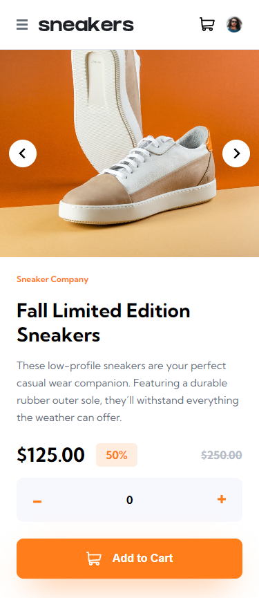
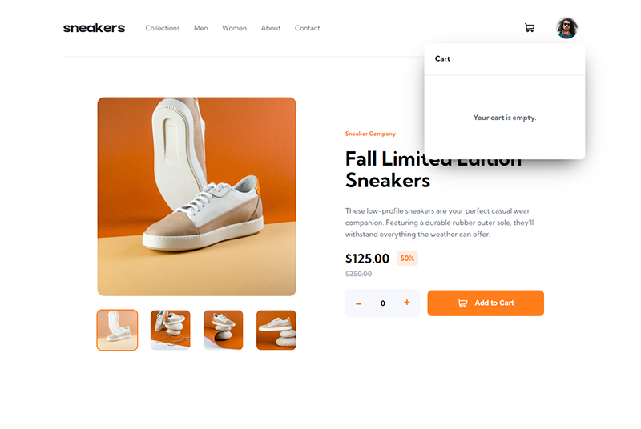
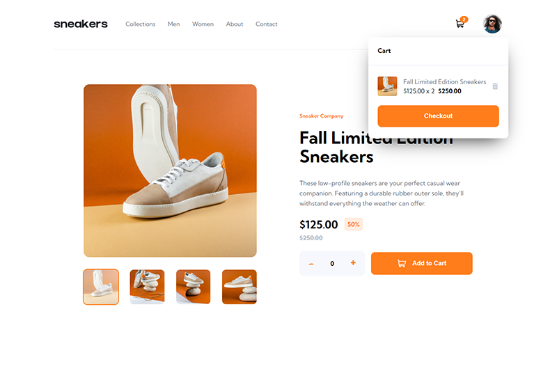

# Frontend Mentor - E-commerce product page solution

This is a solution to the [E-commerce product page challenge on Frontend Mentor](https://www.frontendmentor.io/challenges/ecommerce-product-page-UPsZ9MJp6). Frontend Mentor challenges help you improve your coding skills by building realistic projects.

## Table of contents

- [Overview](#overview)
  - [The challenge](#the-challenge)
  - [Screenshot](#screenshot)
  - [Links](#links)
- [My process](#my-process)
  - [Built with](#built-with)
  - [What I learned](#what-i-learned)
  - [Continued development](#continued-development)
- [Author](#author)

## Overview

### The challenge

Users should be able to:

- View the optimal layout for the site depending on their device's screen size
- See hover states for all interactive elements on the page
- Open a lightbox gallery by clicking on the large product image
- Switch the large product image by clicking on the small thumbnail images
- Add items to the cart
- View the cart and remove items from it

### Screenshot






### Links

- Solution URL: [Github Repository](https://github.com/Kijimai/ecommerce-vite-react)
- Live Site URL: [Netlify Hosted Website](https://ecommerce-reactjs-vite.netlify.app/)

## My process

### Built with

- Mobile-first workflow
- [Prop Types](https://www.npmjs.com/package/prop-types) - Prop Types for individual components
- [React](https://reactjs.org/) - JS library
- [ViteJS](https://vitejs.dev/) - Versatile Build Tool
- [Styled Components](https://styled-components.com/) - For styles

### What I learned

This project was by far the most difficult frontend mentor project I've ever undertaken. Though challenging, it was quite a fun and valuable learning experience for me.

I wanted to make use of and try ViteJS to initialize this project with React and style the components with styled components for quicker development and easier maintainability. It also has the potential to be a minor component for a larger, fullstack version of this project.

#### Initializing with ViteJS was easy:

```git
 npm create vite@latest
```

to start the process and choosing React as the template for the project. For now I opted for Vanilla Javascript instead of Typescript but in future project I will begin integrating Typescript to get more practice with it.

#### Using Styled Components:

```js
import styled from "styled-components"

const StyledComponent = styled.article`
  padding: 20px;
  margin: 0 auto;
  /* other styling you want! */
`
```

In particular the reusable components like the cart button was styled like so:

```js
const StyledButton = styled.button`
  display: flex;
  align-items: center;
  justify-content: center;
  gap: 1.6rem;
  width: 100%;
  background-color: hsl(var(--orange));
  padding: 1.9rem;
  border-radius: 1rem;
  color: hsl(var(--white));
  font-size: 1.6rem;
  font-weight: 700;
`
```

### Continued development

The function to remove a cart product was crudely implented to clear out the cart's state in the global reducer, if I were to fully implement a specific product removal function I would use a filter function to target a specific item's id and remove it from the list.
I use a switch-case statement to specify what action I want to take.

```js
switch (action.type) {
  case "REMOVE_ITEM":
    const { id: itemId } = action.payload
    const newCart = state.cart.filter((product) => {
      return product.productId !== itemId
    })
    return { ...state, cart: [] }
}
```

## Author

- Website - [JibbyCodes](https://jdbucog.netlify.com/)
- Frontend Mentor - [@Kijimai](https://www.frontendmentor.io/profile/Kijimai)
