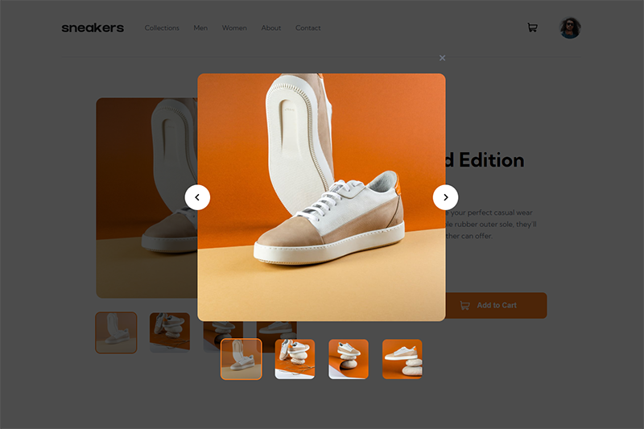

# Frontend Mentor - E-commerce product page solution

This is a solution to the [E-commerce product page challenge on Frontend Mentor](https://www.frontendmentor.io/challenges/ecommerce-product-page-UPsZ9MJp6). Frontend Mentor challenges help you improve your coding skills by building realistic projects.

## Table of contents

- [Overview](#overview)
  - [The challenge](#the-challenge)
  - [Screenshot](#screenshot)
  - [Links](#links)
- [My process](#my-process)
  - [Built with](#built-with)
  - [What I learned](#what-i-learned)
  - [Continued development](#continued-development)
  - [Useful resources](#useful-resources)
- [Author](#author)
- [Acknowledgments](#acknowledgments)

## Overview

### The challenge

Users should be able to:

- View the optimal layout for the site depending on their device's screen size
- See hover states for all interactive elements on the page
- Open a lightbox gallery by clicking on the large product image
- Switch the large product image by clicking on the small thumbnail images
- Add items to the cart
- View the cart and remove items from it

### Screenshot




### Links

- Solution URL: [Github Repository](https://github.com/Kijimai/ecommerce-vite-react)
- Live Site URL: [Netlify Hosted Website](https://ecommerce-reactjs-vite.netlify.app/)

## My process

### Built with

- ReactJS
- ViteJS
- Styled Components
- Mobile-first workflow
- [Prop Types](https://www.npmjs.com/package/prop-types) - Prop Types for individual components
- [React](https://reactjs.org/) - JS library
- [ViteJS](https://vitejs.dev/) - Versatile Build Tool
- [Styled Components](https://styled-components.com/) - For styles

### What I learned

This project was by far the most difficult frontend mentor project I've ever undertaken. Though challenging, it was quite a fun and valuable learning experience for me.

I wanted to make use of and try ViteJS to initialize this project with React and style the components with styled components for quicker development and easier maintainability. It also has the potential to be a minor component for a larger, fullstack version of this project.

#### Initializing with ViteJS was easy:

```git
 npm create vite@latest
```

to start the process and choosing React as the template for the project. For now I opted for Vanilla Javascript instead of Typescript but in future project I will begin integrating Typescript to get more practice with it.

#### Using Styled Components:

```js

```

### Continued development

Use this section to outline areas that you want to continue focusing on in future projects. These could be concepts you're still not completely comfortable with or techniques you found useful that you want to refine and perfect.

**Note: Delete this note and the content within this section and replace with your own plans for continued development.**

### Useful resources

- [Example resource 1](https://www.example.com) - This helped me for XYZ reason. I really liked this pattern and will use it going forward.
- [Example resource 2](https://www.example.com) - This is an amazing article which helped me finally understand XYZ. I'd recommend it to anyone still learning this concept.

**Note: Delete this note and replace the list above with resources that helped you during the challenge. These could come in handy for anyone viewing your solution or for yourself when you look back on this project in the future.**

## Author

- Website - [Add your name here](https://www.your-site.com)
- Frontend Mentor - [@yourusername](https://www.frontendmentor.io/profile/yourusername)
- Twitter - [@yourusername](https://www.twitter.com/yourusername)

**Note: Delete this note and add/remove/edit lines above based on what links you'd like to share.**

## Acknowledgments

This is where you can give a hat tip to anyone who helped you out on this project. Perhaps you worked in a team or got some inspiration from someone else's solution. This is the perfect place to give them some credit.

**Note: Delete this note and edit this section's content as necessary. If you completed this challenge by yourself, feel free to delete this section entirely.**
